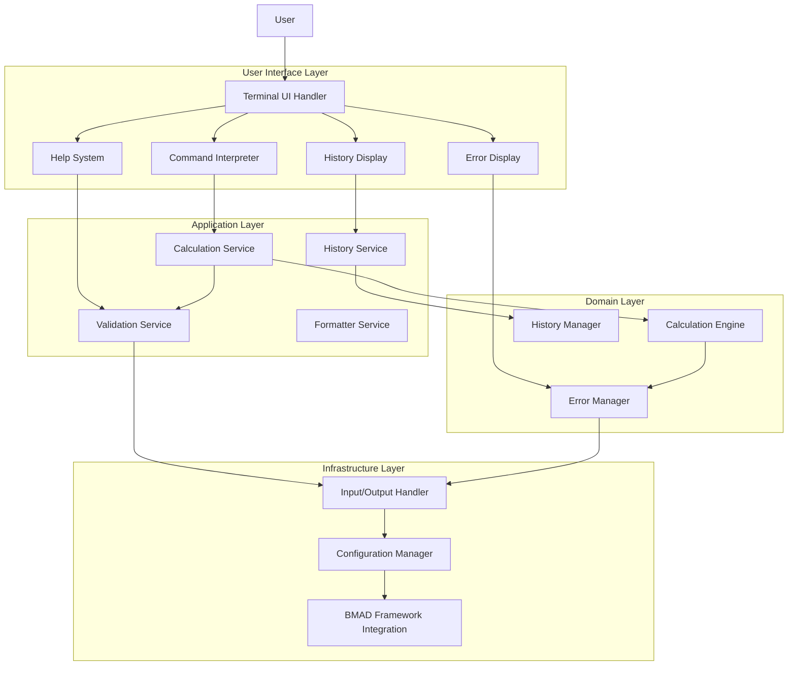
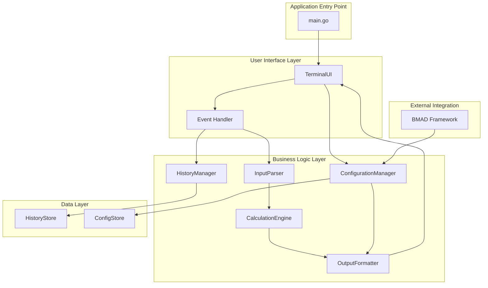
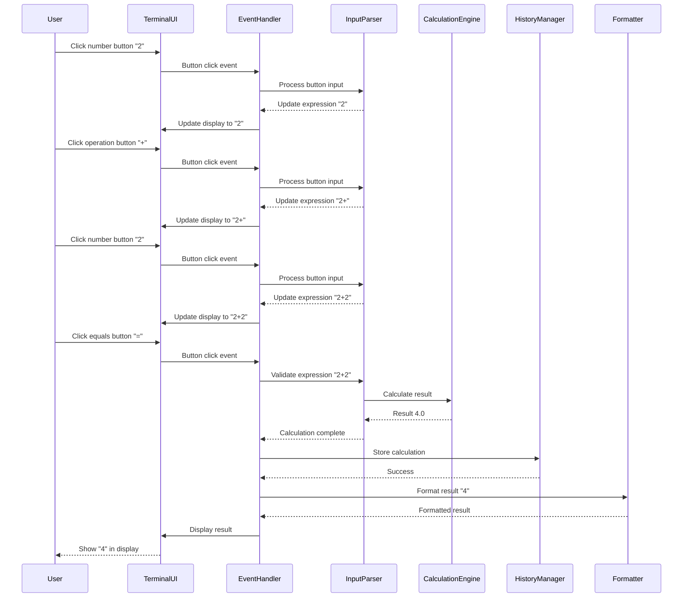
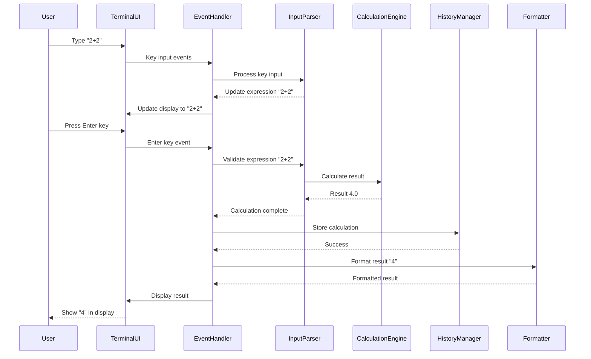
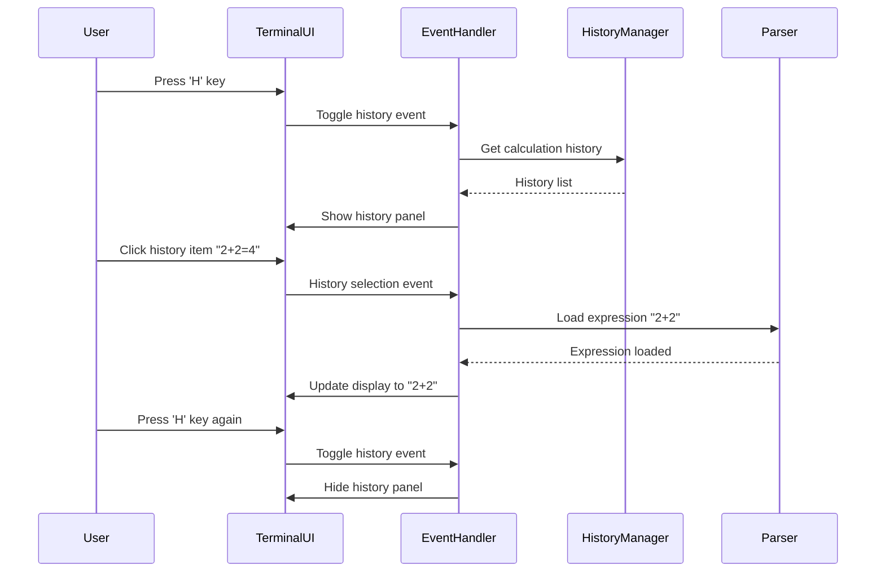
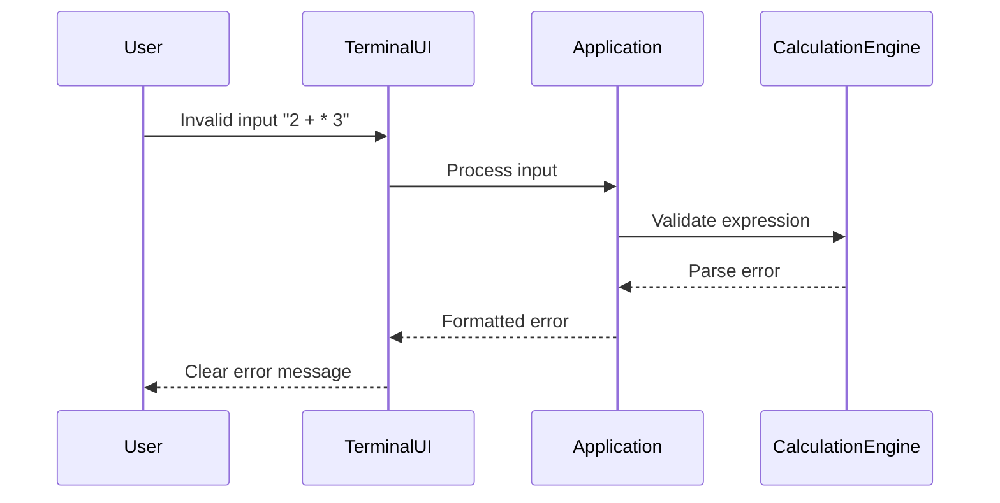

# Calculator Fullstack Architecture Document

## Introduction

This document outlines the complete fullstack architecture for Calculator, including the backend calculation engine, terminal-based user interface, and their integration. It serves as the single source of truth for AI-driven development, ensuring consistency across the entire technology stack.

This unified approach combines what would traditionally be separate backend and frontend architecture documents, streamlining the development process for modern terminal-based applications where these concerns are increasingly intertwined.

### Starter Template or Existing Project

N/A - Greenfield project

### Change Log

| Date | Version | Description | Author |
|------|---------|-------------|---------|
| 2025-09-19 | v1.0 | Initial fullstack architecture creation | Winston (Architect) |

## High Level Architecture

### Technical Summary

The Calculator application employs a simplified modular architecture featuring a visual Terminal User Interface (TUI) that resembles traditional calculator applications. Built with Go 1.21+ and the Tview library for rich terminal interfaces, the application provides an interactive calculator with full mouse and keyboard support, visual buttons, real-time display, and intuitive navigation. The architecture prioritizes user experience with immediate visual feedback while maintaining clean separation between the calculation engine and presentation layer.

### Platform and Infrastructure Choice

**Platform:** Native cross-platform terminal application
**Key Services:** Tview terminal UI library, Go standard library, BMAD framework integration
**Deployment Host and Regions:** Local deployment on Linux, macOS, and Windows systems

### Repository Structure

**Structure:** Monorepo with clear module separation
**Monorepo Tool:** Go modules (native)
**Package Organization:** Domain-driven design with clear separation of concerns

### High Level Architecture Diagram



### Architectural Patterns

- **Modular Monolith:** Single executable with clear internal module boundaries - _Rationale:_ Simple deployment, clear separation of concerns, suitable for calculator application complexity
- **Domain-Driven Design:** Core calculation logic separated from UI concerns - _Rationale:_ Business logic isolation, easier testing, better maintainability
- **Command Pattern:** User input mapped to command objects for processing - _Rationale:_ Flexible input handling, easy extension, clear separation of parsing and execution
- **Strategy Pattern:** Different calculation strategies for various operations - _Rationale:_ Easy to add new operations, algorithm isolation, better testability
- **Observer Pattern:** For history tracking and UI updates - _Rationale:_ Decoupled state management, flexible event handling
- **Factory Pattern:** For creating calculation operations and formatters - _Rationale:_ Encapsulates creation logic, promotes loose coupling
- **Repository Pattern:** For history persistence and configuration access - _Rationale:_ Data access abstraction, easier testing, future database migration flexibility

## Tech Stack

This is the DEFINITIVE technology selection for the entire project. All development must use these exact versions.

### Technology Stack Table

| Category | Technology | Version | Purpose | Rationale |
|----------|------------|---------|---------|-----------|
| Frontend Language | Go | 1.21+ | Terminal UI development | Cross-platform compilation, excellent performance, robust standard library |
| Frontend Framework | Tview | Latest | Terminal UI components | Popular TUI framework with rich widgets, mouse support, and cross-platform compatibility |
| UI Component Library | Custom ANSI components | v1.0 | Terminal UI components | Minimal dependencies, terminal-native appearance |
| State Management | Go channels & structs | Native | Application state management | Simple, performant, idiomatic Go patterns |
| Backend Language | Go | 1.21+ | Calculation engine and business logic | Type safety, excellent performance, cross-platform |
| Backend Framework | Standard library | Native | Core application framework | Minimal dependencies, robust and well-tested |
| API Style | TUI Events | v1.0 | User interface protocol | Visual calculator interface with mouse and keyboard events, intuitive interaction |
| Database | Not required | - | Local history storage | In-memory storage with optional file persistence for session history |
| Cache | In-memory cache | Native | Runtime performance optimization | Fast access, minimal overhead, simple implementation |
| File Storage | Local filesystem | Native | Configuration and history files | Cross-platform, no external dependencies |
| Authentication | Not required | - | Terminal application security | Single-user local application, no external access |
| Frontend Testing | Go testing | Native | Terminal UI testing | Integrated with Go toolchain, mock-friendly |
| Backend Testing | Go testing | Native | Calculation engine testing | Built-in testing framework, benchmarking support |
| E2E Testing | CLI automation | v1.0 | Full application testing | Real terminal interaction testing, cross-platform |
| Build Tool | Go build | 1.21+ | Application compilation | Simple, fast, cross-platform compilation |
| Bundler | Go modules | 1.21+ | Dependency management | Official dependency management, version pinning |
| IaC Tool | Not required | - | Infrastructure management | Local deployment, no cloud infrastructure |
| CI/CD | GitHub Actions | Latest | Automated testing and building | Free for public repos, cross-platform testing |
| Monitoring | Structured logging | Native | Application monitoring | Built-in Go logging, configurable output levels |
| Logging | Go log package | Native | Application logging | Standard library integration, flexible output |
| CSS Framework | ANSI escape codes | v1.0 | Terminal styling | Cross-platform terminal formatting, minimal overhead |

## Data Models

### Calculation

**Purpose:** Represents a mathematical calculation with its inputs, operations, and results

**Key Attributes:**
- id: string - Unique identifier for the calculation
- expression: string - The mathematical expression entered by the user
- result: float64 - The calculated result
- timestamp: time.Time - When the calculation was performed
- operation: string - The type of operation (add, subtract, multiply, divide)
- operands: []float64 - The numbers used in the calculation
- error: string - Error message if calculation failed

**Go Struct:**
```go
type Calculation struct {
    ID        string      `json:"id"`
    Expression string      `json:"expression"`
    Result    float64     `json:"result"`
    Timestamp time.Time   `json:"timestamp"`
    Operation string      `json:"operation"`
    Operands  []float64   `json:"operands"`
    Error     string      `json:"error,omitempty"`
}
```

**Relationships:**
- A Calculation belongs to a History session
- Multiple calculations can be part of a batch operation
- Calculations can be exported to different formats

### History

**Purpose:** Manages the session history of calculations performed by the user

**Key Attributes:**
- id: string - Unique identifier for the history session
- session_id: string - Identifier for the current terminal session
- calculations: []Calculation - List of calculations in this session
- created_at: time.Time - When the session started
- last_updated: time.Time - When the session was last modified
- size: int - Number of calculations in the session

**Go Struct:**
```go
type History struct {
    ID           string         `json:"id"`
    SessionID    string         `json:"session_id"`
    Calculations []Calculation  `json:"calculations"`
    CreatedAt    time.Time      `json:"created_at"`
    LastUpdated time.Time      `json:"last_updated"`
    Size         int            `json:"size"`
}
```

**Relationships:**
- A History contains multiple Calculations
- A History belongs to a user session
- History can be persisted to file or database

### Configuration

**Purpose:** Stores application configuration and user preferences

**Key Attributes:**
- precision: int - Number of decimal places for output
- max_history: int - Maximum number of calculations to keep in memory
- auto_save: bool - Whether to automatically save history
- theme: string - Color theme for terminal output
- debug_mode: bool - Enable debug logging
- batch_mode: bool - Default to batch processing mode
- output_format: string - Format for batch output (json, csv, text)
- scientific_mode: bool - Enable scientific calculation features (future)

**Go Struct:**
```go
type Configuration struct {
    Precision       int     `yaml:"precision" json:"precision"`
    MaxHistory      int     `yaml:"max_history" json:"max_history"`
    AutoSave        bool    `yaml:"auto_save" json:"auto_save"`
    Theme           string  `yaml:"theme" json:"theme"`
    DebugMode       bool    `yaml:"debug_mode" json:"debug_mode"`
    BatchMode       bool    `yaml:"batch_mode" json:"batch_mode"`
    OutputFormat    string  `yaml:"output_format" json:"output_format"`
    ScientificMode  bool    `yaml:"scientific_mode" json:"scientific_mode"`
}
```

**Relationships:**
- Configuration is used by the Calculation Service for formatting
- Configuration is loaded/saved by the Configuration Manager
- Configuration affects UI display preferences

## User Interface Specification

Since this is a TUI-based application with a visual calculator interface, the user interaction model focuses on visual elements and events rather than traditional commands.

### TUI Calculator Interface

**Visual Layout:**
```
┌─────────────────────────────────────────────────────────────┐
│                     Calculator v1.0                        │
├─────────────────────────────────────────────────────────────┤
│                                                     [H] │
│                    12,345.67                          [C] │
│                                                         │
│ ┌─────┐ ┌─────┐ ┌─────┐ ┌─────┐ ┌─────┐ ┌─────┐         │
│ │  7  │ │  8  │ │  9  │ │  +  │ │  (  │ │  )  │         │
│ └─────┘ └─────┘ └─────┘ └─────┘ └─────┘ └─────┘         │
│ ┌─────┐ ┌─────┐ ┌─────┐ ┌─────┐ ┌─────┐ ┌─────┐         │
│ │  4  │ │  5  │ │  6  │ │  -  │ │  π  │ │  e  │         │
│ └─────┘ └─────┘ └─────┘ └─────┘ └─────┘ └─────┘         │
│ ┌─────┐ ┌─────┐ ┌─────┐ ┌─────┐ ┌─────┐ ┌─────┐         │
│ │  1  │ │  2  │ │  3  │ │  *  │ │  x² │ │  √  │         │
│ └─────┘ └─────┘ └─────┘ └─────┘ └─────┘ └─────┘         │
│ ┌─────┐ ┌─────┐ ┌─────┐ ┌─────┐ ┌─────┐ ┌─────┐         │
│ │  0  │ │  .  │ │  ±  │ │  /  │ │  %  │ │  =  │         │
│ └─────┘ └─────┘ └─────┘ └─────┘ └─────┘ └─────┘         │
├─────────────────────────────────────────────────────────────┤
│ History:                                                   │
│ 1. 2 + 2 = 4                                               │
│ 2. 10 * 5 = 50                                              │
│ 3. 100 / 4 = 25                                             │
└─────────────────────────────────────────────────────────────┘
```

**Interaction Methods:**
- **Mouse**: Click on calculator buttons to input numbers and operations
- **Keyboard**: Direct number key input, operation keys (+, -, *, /), Enter for equals
- **Navigation**: Arrow keys to move between buttons, Tab/Shift+Tab for navigation
- **Shortcuts**: 
  - `H` - Show/Hide history panel
  - `C` - Clear current calculation
  - `Esc` - Exit application
  - `Ctrl+C` - Exit application

**State Display:**
- **Current expression**: Shows the expression being built
- **Current result**: Displays calculation results with proper formatting
- **Error messages**: Shows validation errors in the display area
- **History panel**: Scrollable list of previous calculations

**Error Display:**
- Visual feedback in the main display area
- Color coding (red for errors, yellow for warnings)
- Clear error messages that guide users to correct input

## Components

### CalculationEngine

**Responsibility:** Core mathematical calculation logic and operation handling

**Key Interfaces:**
- `Calculate(expression string) (float64, error)` - Parse and calculate expressions
- `Validate(expression string) error` - Validate mathematical expression syntax
- `GetSupportedOperations() []string` - List available operations

**Dependencies:** None (pure calculation logic)

**Technology Stack:** Go 1.21+ with math/big for precision arithmetic

### TerminalUI

**Responsibility:** Manage visual calculator interface with TUI components and event handling

**Key Interfaces:**
- `InitializeUI()` - Set up the TUI layout and components
- `DisplayResult(result float64, expression string)` - Update result display
- `DisplayError(message string)` - Show error messages in display area
- `UpdateDisplay(text string)` - Update the main display area
- `HandleMouseEvent(event MouseEvent)` - Process mouse clicks on buttons
- `HandleKeyEvent(event KeyEvent)` - Process keyboard input
- `UpdateHistoryPanel(history []Calculation)` - Refresh history display
- `ToggleHistoryPanel()` - Show/hide history panel

**Dependencies:** CalculationEngine, HistoryManager, Configuration

**Technology Stack:** Tview framework for rich TUI components, event handling, mouse support

### HistoryManager

**Responsibility:** Manage calculation history storage and retrieval

**Key Interfaces:**
- `AddCalculation(calc Calculation)` - Add calculation to history
- `GetHistory() []Calculation` - Retrieve all history
- `ClearHistory()` - Clear all history
- `SaveHistory(path string) error` - Save history to file
- `LoadHistory(path string) error` - Load history from file

**Dependencies:** Configuration, FileSystem

**Technology Stack:** Go standard library, file-based persistence for session history

### InputParser

**Responsibility:** Parse and validate calculator button input and keyboard events

**Key Interfaces:**
- `ProcessButtonInput(button Button) (*Calculation, error)` - Process calculator button presses
- `ProcessKeyInput(key Key) (*Calculation, error)` - Process direct keyboard input
- `BuildExpression(currentExpr string, input string) (string, error)` - Build expressions incrementally
- `ValidateExpression(expression string) error` - Validate complete expression syntax
- `GetCurrentExpression() string` - Get the current expression being built

**Dependencies:** CalculationEngine

**Technology Stack:** Go string parsing, expression building, state management

### OutputFormatter

**Responsibility:** Format calculation results for display

**Key Interfaces:**
- `FormatResult(result float64, precision int) string` - Format numerical result
- `FormatError(error Error) string` - Format error messages
- `FormatHistoryItem(calc Calculation) string` - Format history entry

**Dependencies:** Configuration

**Technology Stack:** Go string formatting, templates

### Configuration Manager

**Responsibility:** Load, save, and manage application configuration

**Key Interfaces:**
- `LoadConfig(path string) (*Configuration, error)` - Load configuration from file
- `SaveConfig(config *Configuration, path string) error` - Save configuration to file
- `GetConfig() *Configuration` - Get current configuration
- `UpdateConfig(key string, value interface{}) error` - Update configuration value

**Dependencies:** FileSystem

**Technology Stack:** Go encoding/json, YAML support

### Component Diagrams



## External APIs

No external APIs are required for this calculator application. All functionality is self-contained within the application.

## Core Workflows

### Button Click Calculation Flow



### Keyboard Input Calculation Flow



### History Interaction Flow



## Data Storage

### File-based History Storage

History will be stored in JSON format for simplicity and portability:

**History File Format (JSON):**
```json
{
  "session_id": "session-123",
  "created_at": "2025-09-19T22:30:00Z",
  "last_updated": "2025-09-19T22:35:00Z",
  "calculations": [
    {
      "id": "calc-1",
      "expression": "2 + 2",
      "result": 4.0,
      "timestamp": "2025-09-19T22:30:15Z",
      "operation": "add",
      "operands": [2.0, 2.0]
    },
    {
      "id": "calc-2", 
      "expression": "10 * 5",
      "result": 50.0,
      "timestamp": "2025-09-19T22:31:00Z",
      "operation": "multiply",
      "operands": [10.0, 5.0]
    }
  ]
}
```

**Configuration File Format (YAML):**
```yaml
precision: 4
max_history: 100
auto_save: true
theme: default
debug_mode: false
batch_mode: false
output_format: text
scientific_mode: false  # For future scientific calculations
```

**Storage Structure:**
```
~/.calculator/
├── config.yaml          # User configuration
├── history/             # History files directory
│   ├── session-123.json
│   └── session-456.json
└── logs/                # Optional log files
```

## Frontend Architecture

### Component Architecture

**Component Organization:**
```
terminal/
├── components/
│   ├── calculator.go      # Main calculator grid component
│   ├── display.go         # Result display component
│   ├── button.go          # Calculator button component
│   ├── history.go         # History panel component
│   ├── keyboard.go        # Keyboard input handler
│   └── theme.go           # Theme management component
├── widgets/
│   ├── grid.go            # Calculator grid layout
│   ├── button_grid.go     # Number and operation buttons
│   ├── display_panel.go   # Main display area
│   └── history_panel.go   # History sidebar
├── events/
│   ├── mouse.go           # Mouse event handling
│   ├── keyboard.go        # Keyboard event handling
│   └── navigation.go      # Focus navigation
├── themes/
│   ├── default.go         # Default color theme
│   ├── dark.go            # Dark theme
│   └── light.go           # Light theme
└── utils/
    ├── focus.go           # Focus management
    ├── layout.go          # Layout utilities
    └── state.go           # UI state management
```

**Component Template:**
```go
package components

import (
    "github.com/calculator/internal/models"
    "github.com/calculator/internal/config"
    "github.com/rivo/tview"
)

type CalculatorComponent struct {
    app         *tview.Application
    grid        *tview.Grid
    display     *tview.TextView
    buttonGrid  *tview.Grid
    historyPanel *tview.List
    config      *config.Configuration
    theme       *Theme
    currentExpr string
    focusIndex  int
}

func NewCalculatorComponent(app *tview.Application, cfg *config.Configuration) *CalculatorComponent {
    return &CalculatorComponent{
        app:        app,
        config:     cfg,
        theme:      GetTheme(cfg.Theme),
        currentExpr: "",
        focusIndex: 0,
    }
}

func (cc *CalculatorComponent) Initialize() error {
    // Initialize TUI components and layout
    cc.createDisplay()
    cc.createButtonGrid()
    cc.createHistoryPanel()
    cc.setupLayout()
    cc.setupEventHandlers()
    return nil
}

func (cc *CalculatorComponent) UpdateDisplay(text string) {
    cc.display.SetText(text)
}

func (cc *CalculatorComponent) AddToExpression(char string) {
    cc.currentExpr += char
    cc.UpdateDisplay(cc.currentExpr)
}

func (cc *CalculatorComponent) ClearExpression() {
    cc.currentExpr = ""
    cc.UpdateDisplay("0")
}
```

### State Management Architecture

**State Structure:**
```go
type UIState struct {
    CurrentExpression string
    DisplayText      string
    LastResult       float64
    History          []models.Calculation
    Config           *config.Configuration
    IsRunning        bool
    FocusPosition    Position
    SelectedButton   string
    ShowHistory      bool
    ErrorMessage     string
}

type Position struct {
    Row int
    Col int
}

type ButtonState struct {
    Label    string
    Value    string
    Focused  bool
    Enabled  bool
    Position Position
}
```

**State Management Patterns:**
- TUI-managed state through tview components
- Reactive updates to UI components
- Event-driven state synchronization
- Focus management for keyboard navigation
- Component-local state for complex widgets

### Event Handling Architecture

**Event Organization:**
```
events/
├── mouse_events.go     # Mouse click and movement handling
├── keyboard_events.go  # Keyboard input and shortcut handling
├── focus_events.go     # Focus management and navigation
├── ui_events.go        # General UI event handling
└── shortcut_events.go  # Keyboard shortcut definitions
```

**Event Handling Pattern:**
```go
type EventHandler struct {
    calculator *components.CalculatorComponent
    parser     *parser.InputParser
    engine     *calculation.CalculationEngine
    history    *history.HistoryManager
}

func (eh *EventHandler) HandleButtonClick(button string) error {
    switch button {
    case "0", "1", "2", "3", "4", "5", "6", "7", "8", "9":
        eh.calculator.AddToExpression(button)
    case "+", "-", "*", "/":
        eh.calculator.AddToExpression(" " + button + " ")
    case "=":
        return eh.processCalculation()
    case "C":
        eh.calculator.ClearExpression()
    case "H":
        eh.calculator.ToggleHistory()
    }
    return nil
}

func (eh *EventHandler) HandleKeyEvent(key *tview.EventKey) *tview.EventKey {
    switch key.Key {
    case tview.KeyEnter:
        eh.processCalculation()
    case tview.KeyEscape:
        eh.calculator.ClearExpression()
    case tview.KeyCtrlH:
        eh.calculator.ToggleHistory()
    default:
        if key.Rune != 0 {
            eh.calculator.AddToExpression(string(key.Rune))
        }
    }
    return key
}
```

### Frontend Services Layer

**TUI Service Setup:**
```go
package services

type TUIService struct {
    app        *tview.Application
    calculator *components.CalculatorComponent
    events     *events.EventHandler
    config     *config.Configuration
}

func NewTUIService(cfg *config.Configuration) *TUIService {
    app := tview.NewApplication()
    calculator := components.NewCalculatorComponent(app, cfg)
    events := events.NewEventHandler(calculator)
    
    return &TUIService{
        app:        app,
        calculator: calculator,
        events:     events,
        config:     cfg,
    }
}

func (ts *TUIService) Initialize() error {
    if err := ts.calculator.Initialize(); err != nil {
        return err
    }
    
    ts.app.SetRoot(ts.calculator.GetGrid(), true)
    return nil
}

func (ts *TUIService) Run() error {
    return ts.app.Run()
}
```

**Service Example:**
```go
type FocusService struct {
    calculator *components.CalculatorComponent
    focusMap   map[string]*tview.Primitive
    currentPos int
}

func (fs *FocusService) MoveFocus(direction string) {
    switch direction {
    case "up":
        fs.currentPos = max(0, fs.currentPos-1)
    case "down":
        fs.currentPos = min(len(fs.focusMap)-1, fs.currentPos+1)
    case "left":
        fs.currentPos = max(0, fs.currentPos-1)
    case "right":
        fs.currentPos = min(len(fs.focusMap)-1, fs.currentPos+1)
    }
    
    // Update focus visually
    fs.updateFocusVisual()
}
```

## Backend Architecture

### Service Architecture

**Service Organization:**
```
internal/
├── calculation/
│   ├── engine.go           # Core calculation engine
│   ├── operations.go       # Mathematical operations
│   ├── validator.go        # Expression validation
│   └── precision.go        # Number formatting
├── history/
│   ├── manager.go          # History management
│   ├── storage.go          # File-based storage
│   ├── session.go          # Session management
│   └── export.go           # History export functionality
├── config/
│   ├── manager.go          # Configuration management
│   ├── loader.go           # Configuration loading
│   ├── saver.go            # Configuration saving
│   └── validator.go        # Configuration validation
├── parser/
│   ├── expression.go       # Expression parsing
│   ├── tokenizer.go        # Token parsing
│   ├── builder.go          # Expression building
│   └── evaluator.go        # Expression evaluation
└── utils/
    ├── math.go             # Mathematical utilities
    ├── formatting.go       # Number formatting
    ├── error.go            # Error handling
    └── validation.go       # Input validation
```

**Calculation Engine Template:**
```go
package calculation

import (
    "math/big"
    "strconv"
    "strings"
)

type CalculationEngine struct {
    precision int
}

func NewCalculationEngine(precision int) *CalculationEngine {
    return &CalculationEngine{
        precision: precision,
    }
}

func (ce *CalculationEngine) Calculate(expression string) (*big.Float, error) {
    // Parse expression into operands and operator
    operands, operator, err := ce.parseExpression(expression)
    if err != nil {
        return nil, err
    }
    
    // Perform calculation with high precision
    result, err := ce.performOperation(operands[0], operands[1], operator)
    if err != nil {
        return nil, err
    }
    
    // Round to specified precision
    return result.SetMode(big.ToNearestEven, uint(ce.precision)), nil
}
```

### File Storage Architecture

**File Storage Design:**
```go
package storage

import (
    "encoding/json"
    "os"
    "path/filepath"
    "time"
)

type HistoryStorage struct {
    basePath string
}

func NewHistoryStorage(basePath string) *HistoryStorage {
    return &HistoryStorage{
        basePath: basePath,
    }
}

func (hs *HistoryStorage) SaveSession(session *models.History) error {
    // Ensure directory exists
    if err := os.MkdirAll(hs.basePath, 0755); err != nil {
        return err
    }
    
    // Create filename
    filename := filepath.Join(hs.basePath, session.SessionID+".json")
    
    // Marshal to JSON
    data, err := json.MarshalIndent(session, "", "  ")
    if err != nil {
        return err
    }
    
    // Write to file
    return os.WriteFile(filename, data, 0644)
}

func (hs *HistoryStorage) LoadSession(sessionID string) (*models.History, error) {
    filename := filepath.Join(hs.basePath, sessionID+".json")
    
    data, err := os.ReadFile(filename)
    if err != nil {
        return nil, err
    }
    
    var session models.History
    if err := json.Unmarshal(data, &session); err != nil {
        return nil, err
    }
    
    return &session, nil
}
```

**Data Access Layer:**
```go
package storage

type HistoryStorage interface {
    SaveSession(session *models.History) error
    LoadSession(sessionID string) (*models.History, error)
    ListSessions() ([]string, error)
    DeleteSession(sessionID string) error
    ExportSession(sessionID string, format string) (string, error)
}

type FileHistoryStorage struct {
    basePath string
}

func NewFileHistoryStorage(basePath string) *FileHistoryStorage {
    return &FileHistoryStorage{
        basePath: basePath,
    }
}
```

### Application Security

**Security Considerations:**
Since this is a local terminal application, traditional authentication is not required. However, we should consider:

**File Security:**
```go
package security

import (
    "os"
    "path/filepath"
)

type FileSecurity struct {
    configPath string
    historyPath string
}

func (fs *FileSecurity) EnsureSecurePermissions() error {
    // Ensure config file has appropriate permissions
    if err := os.Chmod(fs.configPath, 0600); err != nil {
        return err
    }
    
    // Ensure history directory has appropriate permissions
    if err := os.Chmod(fs.historyPath, 0700); err != nil {
        return err
    }
    
    return nil
}

func (fs *FileSecurity) ValidateFilePath(path string) bool {
    // Prevent directory traversal attacks
    cleanPath := filepath.Clean(path)
    return filepath.HasPrefix(cleanPath, filepath.Dir(fs.configPath))
}
```

**Input Validation:**
```go
package validation

import (
    "regexp"
    "strings"
)

type InputValidator struct {
    // Regular expression for valid mathematical expressions
    expressionRegex *regexp.Regexp
}

func NewInputValidator() *InputValidator {
    return &InputValidator{
        expressionRegex: regexp.MustCompile(`^[0-9\s\+\-\*\/\(\)\.]+$`),
    }
}

func (iv *InputValidator) ValidateExpression(expression string) error {
    // Check for potentially dangerous characters
    if !iv.expressionRegex.MatchString(expression) {
        return errors.New("invalid characters in expression")
    }
    
    // Check for division by zero
    if strings.Contains(expression, "/ 0") || strings.Contains(expression, "/0") {
        return errors.New("division by zero")
    }
    
    return nil
}
```

## Unified Project Structure

```
calculator/
├── .github/                    # CI/CD workflows
│   └── workflows/
│       ├── ci.yaml
│       └── release.yaml
├── cmd/
│   └── calculator/              # Main application
│       └── main.go
├── internal/                   # Internal application code
│   ├── calculation/            # Calculation engine
│   │   ├── engine.go
│   │   ├── operations.go
│   │   └── validator.go
│   ├── terminal/               # Terminal UI components
│   │   ├── components/
│   │   ├── handlers/
│   │   ├── themes/
│   │   └── utils/
│   ├── config/                  # Configuration management
│   │   ├── config.go
│   │   └── loader.go
│   ├── history/                 # History management
│   │   ├── manager.go
│   │   └── storage.go
│   ├── parser/                  # Input parsing
│   │   ├── parser.go
│   │   └── validator.go
│   └── models/                  # Data models
│       ├── calculation.go
│       ├── config.go
│       └── history.go
├── pkg/                        # Public packages
│   ├── calculator/             # Calculator library
│   └── terminal/               # Terminal utilities
├── test/                       # Test files
│   ├── integration/
│   ├── unit/
│   └── e2e/
├── docs/                       # Documentation
│   ├── prd.md
│   ├── front-end-spec.md
│   └── fullstack-architecture.md
├── scripts/                    # Build and deployment scripts
│   ├── build.sh
│   ├── test.sh
│   └── release.sh
├── configs/                    # Configuration files
│   ├── default.yaml
│   └── themes/
├── go.mod                      # Go modules
├── go.sum                      # Go modules checksum
├── Makefile                    # Build automation
└── README.md                   # Project documentation
```

## Development Workflow

### Local Development Setup

**Prerequisites:**
```bash
# Install Go 1.21+
curl -OL https://golang.org/dl/go1.21.0.linux-amd64.tar.gz
sudo tar -C /usr/local -xzf go1.21.0.linux-amd64.tar.gz

# Set up environment
echo 'export PATH=$PATH:/usr/local/go/bin' >> ~/.bashrc
source ~/.bashrc

# Verify installation
go version
```

**Initial Setup:**
```bash
# Clone repository
git clone https://github.com/username/calculator.git
cd calculator

# Install dependencies
go mod tidy

# Build for testing
go build -o calculator cmd/calculator/main.go

# Run tests
go test ./...

# Run application
./calculator
```

**Development Commands:**
```bash
# Start calculator in interactive mode
go run cmd/calculator/main.go

# Run tests
go test ./...

# Run with coverage
go test -cover ./...

# Run benchmarks
go test -bench=. ./...

# Build for current platform
go build -o calculator cmd/calculator/main.go

# Build for multiple platforms
./scripts/build.sh

# Run linting
golangci-lint run

# Format code
go fmt ./...
```

### Environment Configuration

**Required Environment Variables:**
```bash
# Application settings
export CALCULATOR_PRECISION=4
export CALCULATOR_MAX_HISTORY=100
export CALCULATOR_AUTO_SAVE=true
export CALCULATOR_THEME=default
export CALCULATOR_DEBUG=false
export CALCULATOR_BATCH_MODE=false
export CALCULATOR_OUTPUT_FORMAT=text

# File paths
export CALCULATOR_CONFIG_PATH=~/.calculator/config.yaml
export CALCULATOR_HISTORY_PATH=~/.calculator/history.db
export CALCULATOR_LOG_PATH=~/.calculator/logs/
```

## Deployment Architecture

### Deployment Strategy

**Frontend Deployment:**
- **Platform:** Native terminal application
- **Build Command:** `go build -o calculator cmd/calculator/main.go`
- **Output Directory:** ./calculator (executable)
- **CDN/Edge:** Not applicable for terminal application

**Backend Deployment:**
- **Platform:** Cross-platform compiled executable
- **Build Command:** `go build -o calculator cmd/calculator/main.go`
- **Deployment Method:** GitHub releases with pre-compiled binaries

### CI/CD Pipeline

```yaml
name: CI/CD Pipeline

on:
  push:
    branches: [ main, develop ]
  pull_request:
    branches: [ main ]

jobs:
  test:
    runs-on: ubuntu-latest
    steps:
    - uses: actions/checkout@v3
    - uses: actions/setup-go@v4
      with:
        go-version: '1.21'
    
    - name: Run tests
      run: go test -v ./...
    
    - name: Run integration tests
      run: go test -tags=integration ./...
    
    - name: Build application
      run: go build -o calculator cmd/calculator/main.go

  build:
    needs: test
    runs-on: ${{ matrix.os }}
    strategy:
      matrix:
        os: [ubuntu-latest, windows-latest, macos-latest]
        arch: [amd64, arm64]
    
    steps:
    - uses: actions/checkout@v3
    - uses: actions/setup-go@v4
      with:
        go-version: '1.21'
    
    - name: Build for ${{ matrix.os }}-${{ matrix.arch }}
      run: |
        GOOS=${{ matrix.os }} GOARCH=${{ matrix.arch }} go build -o calculator-${{ matrix.os }}-${{ matrix.arch }} cmd/calculator/main.go
    
    - name: Upload artifacts
      uses: actions/upload-artifact@v3
      with:
        name: calculator-${{ matrix.os }}-${{ matrix.arch }}
        path: calculator-${{ matrix.os }}-${{ matrix.arch }}
```

### Environments

| Environment | Frontend URL | Backend URL | Purpose |
|-------------|--------------|-------------|---------|
| Development | Local terminal | Local executable | Local development |
| Testing | CI/CD pipeline | Test runners | Automated testing |
| Production | User's terminal | Released binaries | End-user deployment |

## Security and Performance

### Security Requirements

**Frontend Security:**
- Input validation for all user expressions
- Safe handling of special characters in terminal
- Protection against buffer overflow attacks
- Secure file operations for history and config

**Backend Security:**
- Memory safety through Go's type system
- Safe math operations with proper overflow handling
- Secure string parsing and validation
- Protection against code injection

**Authentication Security:**
- No authentication required for local application
- Optional file permissions for shared installations

### Performance Optimization

**Frontend Performance:**
- Application startup time under 100ms
- Calculation results within 50ms
- Efficient terminal rendering
- Minimal memory footprint

**Backend Performance:**
- Optimized mathematical operations
- Efficient memory usage for large histories
- Fast file I/O for persistence
- Responsive input handling

## Testing Strategy

### Testing Pyramid

```
E2E Tests (10%)
/        \
Integration Tests (30%)
/            \
Frontend Unit Tests (30%)  Backend Unit Tests (30%)
```

### Test Organization

**Frontend Tests:**
```
test/unit/terminal/
├── components/
│   ├── prompt_test.go
│   ├── display_test.go
│   └── history_test.go
├── handlers/
│   ├── input_test.go
│   └── navigation_test.go
└── utils/
    ├── ansi_test.go
    └── screen_test.go
```

**Backend Tests:**
```
test/unit/calculation/
├── engine_test.go
├── operations_test.go
├── validator_test.go
└── parser_test.go

test/integration/
├── end_to_end_test.go
├── history_test.go
└── config_test.go
```

**E2E Tests:**
```
test/e2e/
├── interactive_test.go
├── batch_test.go
├── history_test.go
└── config_test.go
```

### Test Examples

**Frontend Component Test:**
```go
func TestDisplayComponent_ShowResult(t *testing.T) {
    config := &config.Configuration{Precision: 2}
    display := NewDisplayComponent(config)
    
    result := 123.456
    expression := "100 + 23.456"
    
    output := display.FormatResult(result, expression)
    
    expected := "100 + 23.456 = 123.46"
    if output != expected {
        t.Errorf("Expected %s, got %s", expected, output)
    }
}
```

**Backend API Test:**
```go
func TestCalculationEngine_Add(t *testing.T) {
    engine := NewCalculationEngine()
    
    result, err := engine.Calculate("2 + 3")
    if err != nil {
        t.Errorf("Unexpected error: %v", err)
    }
    
    if result != 5 {
        t.Errorf("Expected 5, got %f", result)
    }
}
```

**E2E Test:**
```go
func TestInteractiveMode(t *testing.T) {
    app := NewCalculatorApp()
    
    // Start interactive mode
    go app.RunInteractive()
    
    // Simulate user input
    app.SendInput("2 + 2")
    app.SendInput("exit")
    
    // Check output
    output := app.GetOutput()
    if !strings.Contains(output, "4") {
        t.Errorf("Expected result 4 in output")
    }
}
```

## Coding Standards

### Critical Fullstack Rules

- **Type Safety:** Always use Go's type system to prevent runtime errors
- **Error Handling:** Always handle errors explicitly, never ignore them
- **Input Validation:** Validate all user input before processing
- **Memory Management:** Use Go's garbage collection effectively, avoid memory leaks
- **Concurrency:** Use goroutines and channels safely, avoid race conditions
- **Testing:** Write tests for all public functions and complex logic
- **Configuration:** Never hardcode configuration values, use config system
- **Logging:** Use structured logging with appropriate log levels

### Naming Conventions

| Element | Go Convention | Example |
|----------|---------------|---------|
| Functions | camelCase | `calculateResult()` |
| Variables | camelCase | `maxHistory` |
| Constants | SCREAMING_SNAKE_CASE | `MAX_PRECISION` |
| Structs | PascalCase | `CalculationEngine` |
| Interfaces | PascalCase with -er suffix | `Parser`, `Calculator` |
| Files | snake_case | `calculation_engine.go` |
| Directories | snake_case | `terminal_components/` |
| Packages | lowercase | `calculator`, `terminal` |

## Error Handling Strategy

### Error Flow



### Error Response Format

```go
type AppError struct {
    Code    string                 `json:"code"`
    Message string                 `json:"message"`
    Details map[string]interface{} `json:"details,omitempty"`
    Context string                 `json:"context"`
}

func (e *AppError) Error() string {
    return fmt.Sprintf("%s: %s", e.Code, e.Message)
}

func NewValidationError(message string) *AppError {
    return &AppError{
        Code:    "VALIDATION_ERROR",
        Message: message,
        Context: "input_validation",
    }
}
```

### Frontend Error Handling

```go
func (ui *TerminalUI) DisplayError(err error) {
    var appErr *AppError
    if errors.As(err, &appErr) {
        ui.colorize.Printf("Error [%s]: %s\n", appErr.Code, appErr.Message)
        if appErr.Details != nil {
            ui.colorize.Printf("Details: %v\n", appErr.Details)
        }
    } else {
        ui.colorize.Printf("Error: %s\n", err.Error())
    }
}
```

### Backend Error Handling

```go
func (ce *CalculationEngine) Calculate(expression string) (float64, error) {
    if !ce.validator.IsValid(expression) {
        return 0, NewValidationError("invalid mathematical expression")
    }
    
    parsed, err := ce.parser.Parse(expression)
    if err != nil {
        return 0, fmt.Errorf("parse error: %w", err)
    }
    
    result, err := ce.executeOperation(parsed)
    if err != nil {
        return 0, fmt.Errorf("calculation error: %w", err)
    }
    
    return result, nil
}
```

## Monitoring and Observability

### Monitoring Stack

- **Frontend Monitoring:** Structured logging with timestamps and request IDs
- **Backend Monitoring:** Performance metrics, error tracking, and usage statistics
- **Error Tracking:** Centralized error logging with stack traces
- **Performance Monitoring:** Calculation timing and memory usage tracking

### Key Metrics

**Frontend Metrics:**
- Application startup time
- Input processing time
- Terminal rendering performance
- Memory usage during operation

**Backend Metrics:**
- Calculation execution time
- Error rates by operation type
- History storage performance
- Configuration load/save times

## Next Steps

### Immediate Actions

1. Set up project structure with Go modules
2. Implement core calculation engine
3. Build terminal UI components
4. Create comprehensive test suite
5. Set up CI/CD pipeline

### Development Priorities

1. **Phase 1:** Core calculation functionality and basic terminal UI
2. **Phase 2:** History management and configuration system
3. **Phase 3:** Advanced features (batch mode, themes, export)
4. **Phase 4:** Performance optimization and testing
5. **Phase 5:** Documentation and deployment preparation

### Integration with BMAD Framework

This architecture is designed to integrate seamlessly with the BMAD framework:

- **Documentation:** Architecture documents stored in `docs/` directory
- **Development:** Follows BMAD coding standards and patterns
- **Testing:** Comprehensive testing aligned with BMAD quality requirements
- **Deployment:** CI/CD pipeline compatible with BMAD workflows
- **Monitoring:** Structured logging for BMAD analytics integration