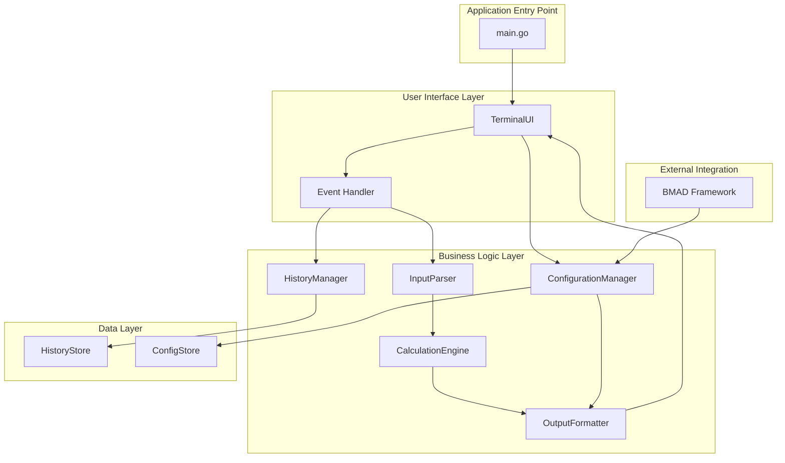

# Components

## CalculationEngine

**Responsibility:** Core mathematical calculation logic and operation handling

**Key Interfaces:**
- `Calculate(expression string) (float64, error)` - Parse and calculate expressions
- `Validate(expression string) error` - Validate mathematical expression syntax
- `GetSupportedOperations() []string` - List available operations

**Dependencies:** None (pure calculation logic)

**Technology Stack:** Go 1.21+ with math/big for precision arithmetic

## TerminalUI

**Responsibility:** Manage visual calculator interface with TUI components and event handling

**Key Interfaces:**
- `InitializeUI()` - Set up the TUI layout and components
- `DisplayResult(result float64, expression string)` - Update result display
- `DisplayError(message string)` - Show error messages in display area
- `UpdateDisplay(text string)` - Update the main display area
- `HandleMouseEvent(event MouseEvent)` - Process mouse clicks on buttons
- `HandleKeyEvent(event KeyEvent)` - Process keyboard input
- `UpdateHistoryPanel(history []Calculation)` - Refresh history display
- `ToggleHistoryPanel()` - Show/hide history panel

**Dependencies:** CalculationEngine, HistoryManager, Configuration

**Technology Stack:** Tview framework for rich TUI components, event handling, mouse support

## HistoryManager

**Responsibility:** Manage calculation history storage and retrieval

**Key Interfaces:**
- `AddCalculation(calc Calculation)` - Add calculation to history
- `GetHistory() []Calculation` - Retrieve all history
- `ClearHistory()` - Clear all history
- `SaveHistory(path string) error` - Save history to file
- `LoadHistory(path string) error` - Load history from file

**Dependencies:** Configuration, FileSystem

**Technology Stack:** Go standard library, file-based persistence for session history

## InputParser

**Responsibility:** Parse and validate calculator button input and keyboard events

**Key Interfaces:**
- `ProcessButtonInput(button Button) (*Calculation, error)` - Process calculator button presses
- `ProcessKeyInput(key Key) (*Calculation, error)` - Process direct keyboard input
- `BuildExpression(currentExpr string, input string) (string, error)` - Build expressions incrementally
- `ValidateExpression(expression string) error` - Validate complete expression syntax
- `GetCurrentExpression() string` - Get the current expression being built

**Dependencies:** CalculationEngine

**Technology Stack:** Go string parsing, expression building, state management

## OutputFormatter

**Responsibility:** Format calculation results for display

**Key Interfaces:**
- `FormatResult(result float64, precision int) string` - Format numerical result
- `FormatError(error Error) string` - Format error messages
- `FormatHistoryItem(calc Calculation) string` - Format history entry

**Dependencies:** Configuration

**Technology Stack:** Go string formatting, templates

## Configuration Manager

**Responsibility:** Load, save, and manage application configuration

**Key Interfaces:**
- `LoadConfig(path string) (*Configuration, error)` - Load configuration from file
- `SaveConfig(config *Configuration, path string) error` - Save configuration to file
- `GetConfig() *Configuration` - Get current configuration
- `UpdateConfig(key string, value interface{}) error` - Update configuration value

**Dependencies:** FileSystem

**Technology Stack:** Go encoding/json, YAML support

## Component Diagrams

