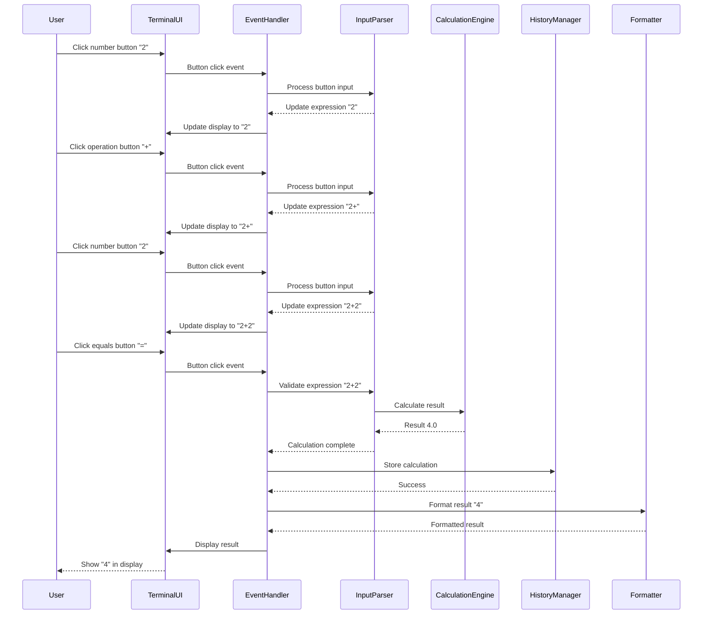
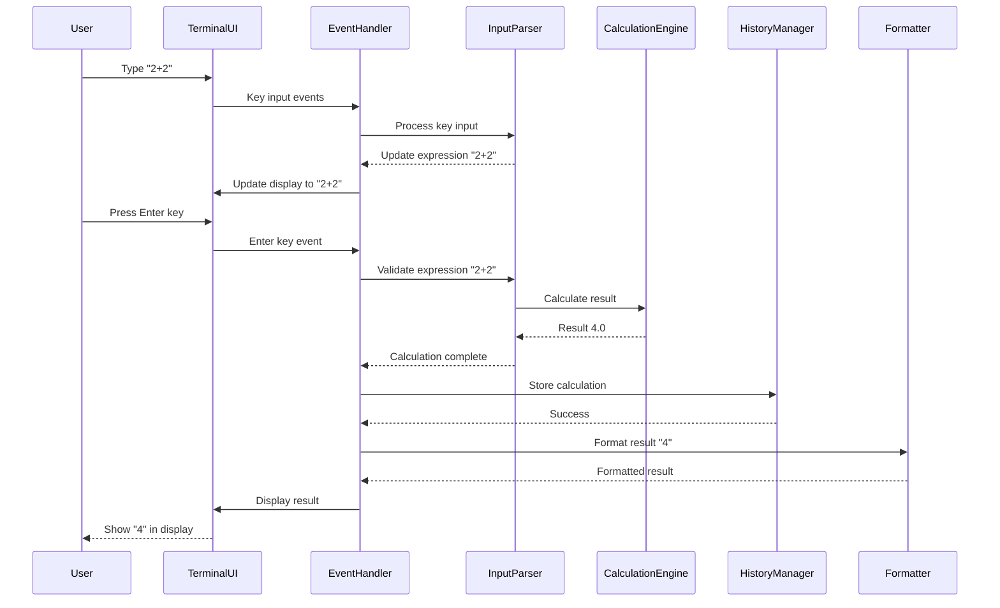
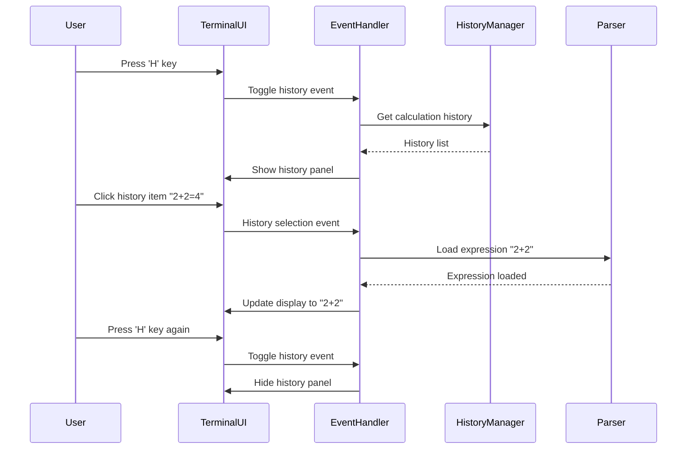

# Core Workflows

## Button Click Calculation Flow

```mermaid
sequenceDiagram
    participant User
    participant UI as TerminalUI
    participant Events as EventHandler
    participant Parser as InputParser
    participant Engine as CalculationEngine
    participant History as HistoryManager
    
    User->>UI: Click number button "2"
    UI->>Events: Button click event
    Events->>Parser: Process button input
    Parser-->>Events: Update expression "2"
    Events->>UI: Update display to "2"
    
    User->>UI: Click operation button "+"
    UI->>Events: Button click event
    Events->>Parser: Process button input
    Parser-->>Events: Update expression "2+"
    Events->>UI: Update display to "2+"
    
    User->>UI: Click number button "2"
    UI->>Events: Button click event
    Events->>Parser: Process button input
    Parser-->>Events: Update expression "2+2"
    Events->>UI: Update display to "2+2"
    
    User->>UI: Click equals button "="
    UI->>Events: Button click event
    Events->>Parser: Validate expression "2+2"
    Parser->>Engine: Calculate result
    Engine-->>Parser: Result 4.0
    Parser-->>Events: Calculation complete
    Events->>History: Store calculation
    History-->>Events: Success
    Events->>Formatter: Format result "4"
    Formatter-->>Events: Formatted result
    Events->>UI: Display result
    UI-->>User: Show "4" in display
```

## Keyboard Input Calculation Flow

```mermaid
sequenceDiagram
    participant User
    participant UI as TerminalUI
    participant Events as EventHandler
    participant Parser as InputParser
    participant Engine as CalculationEngine
    participant History as HistoryManager
    
    User->>UI: Type "2+2"
    UI->>Events: Key input events
    Events->>Parser: Process key input
    Parser-->>Events: Update expression "2+2"
    Events->>UI: Update display to "2+2"
    
    User->>UI: Press Enter key
    UI->>Events: Enter key event
    Events->>Parser: Validate expression "2+2"
    Parser->>Engine: Calculate result
    Engine-->>Parser: Result 4.0
    Parser-->>Events: Calculation complete
    Events->>History: Store calculation
    History-->>Events: Success
    Events->>Formatter: Format result "4"
    Formatter-->>Events: Formatted result
    Events->>UI: Display result
    UI-->>User: Show "4" in display
```

## History Interaction Flow

```mermaid
sequenceDiagram
    participant User
    participant UI as TerminalUI
    participant Events as EventHandler
    participant History as HistoryManager
    
    User->>UI: Press 'H' key
    UI->>Events: Toggle history event
    Events->>History: Get calculation history
    History-->>Events: History list
    Events->>UI: Show history panel
    
    User->>UI: Click history item "2+2=4"
    UI->>Events: History selection event
    Events->>Parser: Load expression "2+2"
    Parser-->>Events: Expression loaded
    Events->>UI: Update display to "2+2"
    
    User->>UI: Press 'H' key again
    UI->>Events: Toggle history event
    Events->>UI: Hide history panel
```
