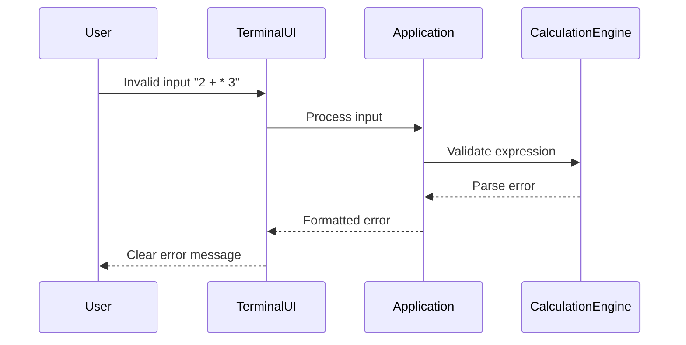

# Error Handling Strategy

## Error Flow



## Error Response Format

```go
type AppError struct {
    Code    string                 `json:"code"`
    Message string                 `json:"message"`
    Details map[string]interface{} `json:"details,omitempty"`
    Context string                 `json:"context"`
}

func (e *AppError) Error() string {
    return fmt.Sprintf("%s: %s", e.Code, e.Message)
}

func NewValidationError(message string) *AppError {
    return &AppError{
        Code:    "VALIDATION_ERROR",
        Message: message,
        Context: "input_validation",
    }
}
```

## Frontend Error Handling

```go
func (ui *TerminalUI) DisplayError(err error) {
    var appErr *AppError
    if errors.As(err, &appErr) {
        ui.colorize.Printf("Error [%s]: %s\n", appErr.Code, appErr.Message)
        if appErr.Details != nil {
            ui.colorize.Printf("Details: %v\n", appErr.Details)
        }
    } else {
        ui.colorize.Printf("Error: %s\n", err.Error())
    }
}
```

## Backend Error Handling

```go
func (ce *CalculationEngine) Calculate(expression string) (float64, error) {
    if !ce.validator.IsValid(expression) {
        return 0, NewValidationError("invalid mathematical expression")
    }
    
    parsed, err := ce.parser.Parse(expression)
    if err != nil {
        return 0, fmt.Errorf("parse error: %w", err)
    }
    
    result, err := ce.executeOperation(parsed)
    if err != nil {
        return 0, fmt.Errorf("calculation error: %w", err)
    }
    
    return result, nil
}
```
