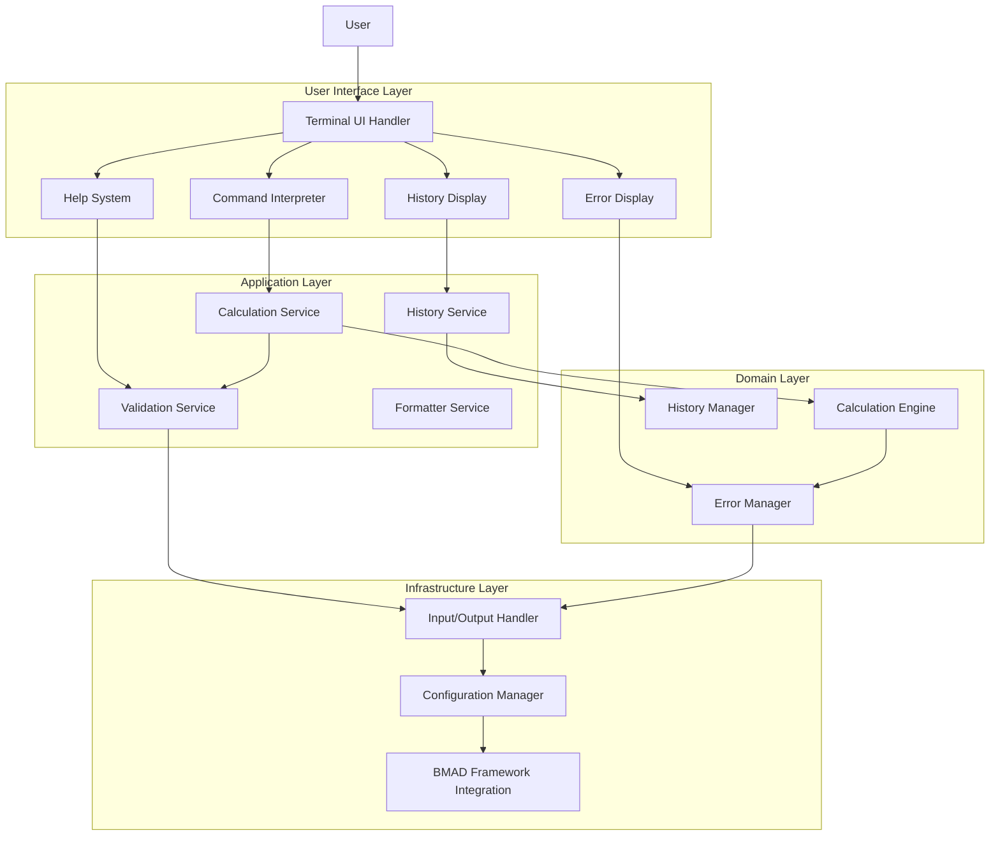

# High Level Architecture

## Technical Summary

The Calculator application employs a simplified modular architecture featuring a visual Terminal User Interface (TUI) that resembles traditional calculator applications. Built with Go 1.21+ and the Tview library for rich terminal interfaces, the application provides an interactive calculator with full mouse and keyboard support, visual buttons, real-time display, and intuitive navigation. The architecture prioritizes user experience with immediate visual feedback while maintaining clean separation between the calculation engine and presentation layer.

## Platform and Infrastructure Choice

**Platform:** Native cross-platform terminal application
**Key Services:** Tview terminal UI library, Go standard library, BMAD framework integration
**Deployment Host and Regions:** Local deployment on Linux, macOS, and Windows systems

## Repository Structure

**Structure:** Monorepo with clear module separation
**Monorepo Tool:** Go modules (native)
**Package Organization:** Domain-driven design with clear separation of concerns

## High Level Architecture Diagram

## Architectural Patterns

- **Modular Monolith:** Single executable with clear internal module boundaries - _Rationale:_ Simple deployment, clear separation of concerns, suitable for calculator application complexity
- **Domain-Driven Design:** Core calculation logic separated from UI concerns - _Rationale:_ Business logic isolation, easier testing, better maintainability
- **Command Pattern:** User input mapped to command objects for processing - _Rationale:_ Flexible input handling, easy extension, clear separation of parsing and execution
- **Strategy Pattern:** Different calculation strategies for various operations - _Rationale:_ Easy to add new operations, algorithm isolation, better testability
- **Observer Pattern:** For history tracking and UI updates - _Rationale:_ Decoupled state management, flexible event handling
- **Factory Pattern:** For creating calculation operations and formatters - _Rationale:_ Encapsulates creation logic, promotes loose coupling
- **Repository Pattern:** For history persistence and configuration access - _Rationale:_ Data access abstraction, easier testing, future database migration flexibility
