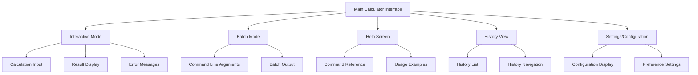
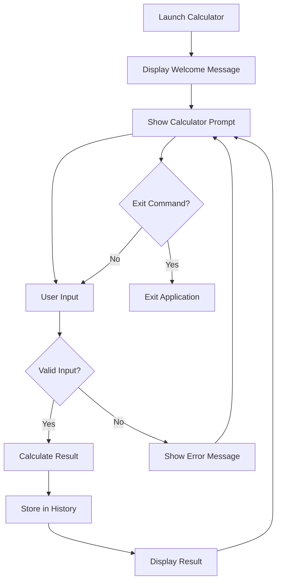
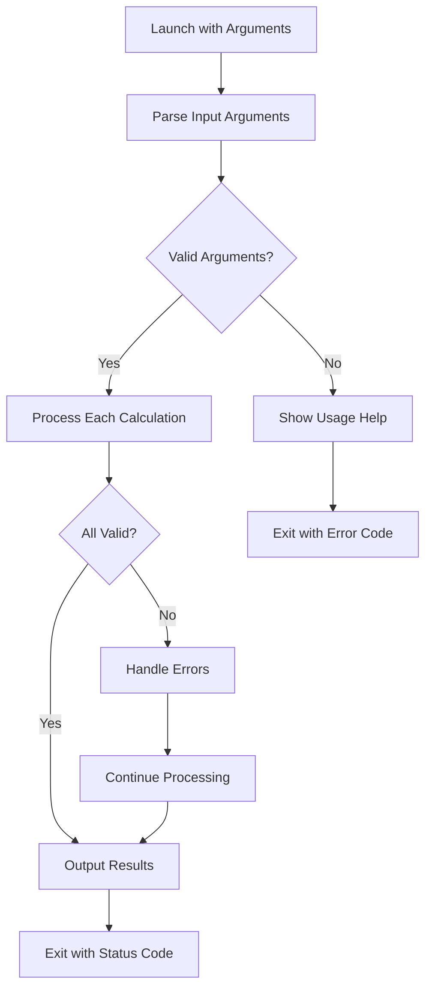
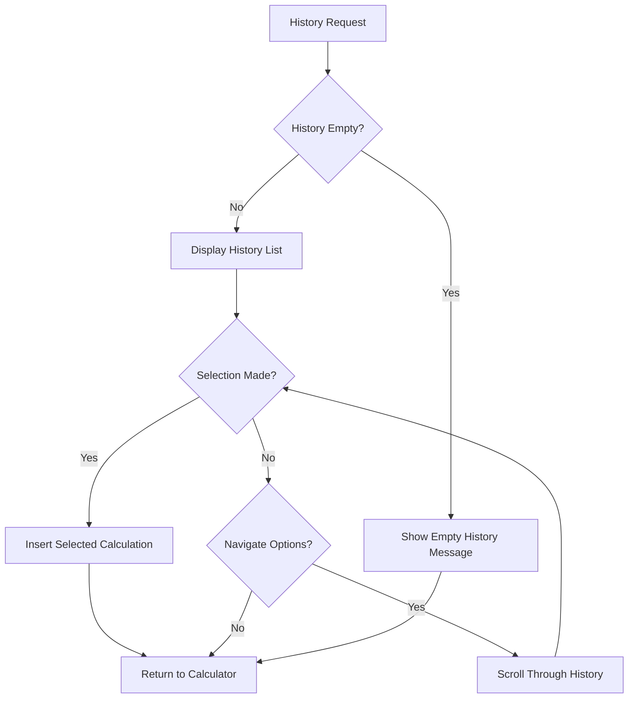
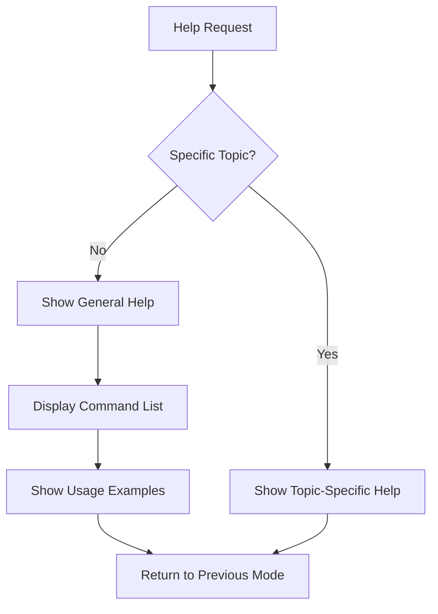

# Calculator UI/UX Specification

## Introduction

This document defines the user experience goals, information architecture, user flows, and visual design specifications for Calculator's user interface. It serves as the foundation for visual design and frontend development, ensuring a cohesive and user-centered experience.

### Overall UX Goals & Principles

#### Target User Personas

**Power User:** Technical professionals and developers who use command-line tools daily, value efficiency, and want advanced features like history navigation and batch processing capabilities.

**Casual User:** Occasional users who need quick calculations, prioritize ease of use, clear guidance, and intuitive interfaces without requiring deep technical knowledge.

**Automation User:** System administrators and script developers who need reliable batch processing, programmatic interfaces, and script-friendly output formats for integration into larger workflows.

#### Usability Goals

- **Ease of learning:** New users can complete basic calculations within 2 minutes of opening the application
- **Efficiency of use:** Power users can complete frequent calculations with minimal keystrokes and keyboard shortcuts
- **Error prevention:** Clear validation and confirmation for destructive actions with helpful error messages
- **Memorability:** Infrequent users can return to the calculator without relearning the interface
- **Accessibility:** All users, including those using screen readers, can effectively use the calculator

#### Design Principles

1. **Clarity over cleverness** - Prioritize clear communication over aesthetic innovation in terminal environments
2. **Progressive disclosure** - Show only what's needed, when it's needed to avoid interface clutter
3. **Consistent patterns** - Use familiar terminal UI patterns throughout the application
4. **Immediate feedback** - Every action should have a clear, immediate response within 50ms
5. **Accessible by default** - Design for all users from the start, including screen reader compatibility

### Change Log

| Date | Version | Description | Author |
|------|---------|-------------|---------|
| 2025-09-19 | v1.0 | Initial UI/UX specification creation | Sally (UX Expert) |

## Information Architecture (IA)

### Site Map / Screen Inventory

### Navigation Structure

**Primary Navigation:** Command-based navigation using simple keywords (help, history, clear, exit) accessible from any screen. The calculator maintains a consistent prompt interface across all modes.

**Secondary Navigation:** Keyboard shortcuts for common operations (Ctrl+C for exit, arrow keys for history navigation, Tab for completion where applicable).

**Breadcrumb Strategy:** Not applicable for terminal application - uses modal approach with clear state indicators (e.g., "Batch Mode", "Viewing History") and clear return paths to main calculator interface.

## User Flows

### Interactive Calculation Flow

**User Goal:** Perform basic arithmetic calculations with immediate feedback and history tracking

**Entry Points:** Direct application launch without arguments, 'calc' command

**Success Criteria:** User can enter calculations, see results immediately, and access calculation history

#### Flow Diagram

**Edge Cases & Error Handling:**
- Invalid mathematical expressions (syntax errors)
- Division by zero attempts
- Number overflow/underflow
- Non-numeric input
- Keyboard interrupt (Ctrl+C)

**Notes:** Interactive mode should maintain calculation history throughout the session and provide clear visual feedback for all operations.

### Batch Processing Flow

**User Goal:** Process multiple calculations efficiently for automation and scripting

**Entry Points:** Command line arguments, piped input, file input

**Success Criteria:** All calculations processed with appropriate output format for scripting

#### Flow Diagram

**Edge Cases & Error Handling:**
- Malformed command line arguments
- Mixed valid and invalid calculations in batch
- Output formatting for different use cases
- Error codes for programmatic handling
- Quiet mode vs verbose mode output

**Notes:** Batch mode should provide script-friendly output options and appropriate exit codes for automation.

### History Navigation Flow

**User Goal:** Access and reuse previous calculations during the session

**Entry Points:** 'history' command, arrow key navigation

**Success Criteria:** User can view, navigate, and reuse historical calculations

#### Flow Diagram

**Edge Cases & Error Handling:**
- Empty history scenarios
- Large history display formatting
- History persistence across sessions
- Clear history command
- History export functionality

**Notes:** History should be easily accessible with minimal keystrokes and provide clear visual indicators for the current position.

### Help System Flow

**User Goal:** Access usage information and command reference

**Entry Points:** 'help' command, '--help' argument, invalid input

**Success Criteria:** User can quickly find relevant usage information

#### Flow Diagram

**Edge Cases & Error Handling:**
- Help request in middle of calculation
- Context-sensitive help needs
- Help depth levels (overview vs detailed)
- Exit from help system
- Help in batch mode vs interactive mode

**Notes:** Help should be context-aware and provide quick access to the most relevant information for the user's current situation.

## Component Library / Design System

### Design System Approach

**Design System Approach:** Terminal-native components using ANSI escape codes for consistent cross-platform appearance. Prioritizing functionality over visual flair while maintaining a clean, professional appearance that works across different terminal emulators.

### Core Components

#### Calculator Prompt Component

**Purpose:** Main interface element for user input and interaction

**Variants:** Standard prompt, error state prompt, history navigation prompt

**States:** Ready for input, processing input, error state, help mode

**Usage Guidelines:** Always visible during interactive mode, clear visual distinction from output, includes session context when applicable

#### Result Display Component

**Purpose:** Display calculation results with appropriate formatting

**Variants:** Single result, batch results, error results

**States:** Success result, error result, warning result, information display

**Usage Guidelines:** Clear visual separation from input prompts, consistent formatting for numbers, appropriate precision display

#### Error Message Component

**Purpose:** Communicate errors and provide guidance for correction

**Variants:** Input validation error, calculation error, system error

**States:** Critical error, warning, information, suggestion

**Usage Guidelines:** Specific error messages with suggested corrections, clear visual distinction from normal output, maintain user context

#### History Display Component

**Purpose:** Show calculation history and allow navigation

**Variants:** Compact list, detailed view, search results

**States:** Empty history, populated history, selected item, filtered view

**Usage Guidelines:** Numbered entries for easy reference, clear visual indicators for selection, scrollable for large histories

#### Help Display Component

**Purpose:** Provide contextual and general usage information

**Variants:** Quick reference, detailed help, command-specific help

**States:** Overview mode, detailed mode, examples mode

**Usage Guidelines:** Hierarchical information display, clear navigation between help levels, practical examples

#### Progress Indicator Component

**Purpose:** Show processing state during batch operations

**Variants:** Simple spinner, progress bar, percentage complete

**States:** Idle, processing, completed, error

**Usage Guidelines:** Minimal impact on workflow, clear when active, non-intrusive during normal operation

#### Input Validation Component

**Purpose:** Real-time validation and feedback for user input

**Variants:** Syntax highlighting, error indicators, completion suggestions

**States:** Valid input, invalid input, partial input, suggested completion

**Usage Guidelines:** Immediate feedback without blocking input, clear visual cues for different validation states

#### Menu Navigation Component

**Purpose:** Navigate through options and settings

**Variants:** Command menu, settings menu, history navigation

**States:** Menu active, item selected, submenu open, menu closed

**Usage Guidelines:** Keyboard-first navigation, clear visual hierarchy, easy escape from menu system

## Branding & Style Guide

### Visual Identity

**Brand Guidelines:** Terminal-native branding with minimal visual elements. Application name and version displayed on startup, consistent formatting throughout, optional ASCII art header for visual interest.

### Color Palette

| Color Type | Hex Code | Usage |
|------------|----------|---------|
| Primary | #FFFFFF | Default text color, ensures maximum readability |
| Secondary | #00FF00 | Success messages, positive feedback, calculation results |
| Accent | #FFFF00 | Warnings, important notices, user attention required |
| Error | #FF0000 | Errors, destructive actions, critical information |
| Warning | #FFA500 | Cautions, non-critical issues, informative messages |
| Information | #00FFFF | Informational messages, system status, help text |
| Neutral | #808080 | Secondary text, separators, less important information |
| Background | #000000 | Default background (terminal default) |
| Highlight | #404040 | Selected items, active elements, current focus |

### Typography

#### Font Families
- **Primary:** Terminal default monospace font
- **Secondary:** Terminal default monospace font (fallback)
- **Monospace:** Terminal default monospace font

#### Type Scale
| Element | Size | Weight | Line Height |
|----------|------|--------|-------------|
| H1 (Title) | Terminal default | Bold | 1.0 |
| H2 (Section) | Terminal default | Bold | 1.0 |
| H3 (Subsection) | Terminal default | Normal | 1.0 |
| Body (Content) | Terminal default | Normal | 1.0 |
| Small (Details) | Terminal default | Normal | 1.0 |

### Iconography

**Icon Library:** ASCII character-based icons and Unicode symbols where supported. Terminal-compatible characters only, no graphical icons.

**Usage Guidelines:** Use simple ASCII characters for status indicators (✓, ✗, →, ←, ↑, ↓). Reserve Unicode symbols for enhanced terminals that support them. Always provide fallbacks for terminals with limited character support.

### Spacing & Layout

**Grid System:** Character-based grid using terminal character positions. No fixed pixel-based layouts. Responsive to terminal window size.

**Spacing Scale:** Single character spacing (1 space) between elements. Line breaks for major section separation. Consistent indentation for hierarchical content.

## Accessibility Requirements

### Compliance Target

**Standard:** WCAG 2.1 Level AA adapted for terminal applications, focusing on keyboard navigation, screen reader compatibility, and high contrast visual design.

### Key Requirements

**Visual:**
- Color contrast ratios: Minimum 4.5:1 for normal text, 3:1 for large text using terminal-appropriate color combinations
- Focus indicators: Clear visual indication of current focus position, distinguishable from regular text
- Text sizing: Respect terminal font size settings, provide options for users who need larger text

**Interaction:**
- Keyboard navigation: Complete functionality via keyboard only, logical tab order, clear navigation paths
- Screen reader support: Text output compatible with screen readers, proper labeling of interactive elements
- Touch targets: Not applicable for terminal application (keyboard-only interface)

**Content:**
- Alternative text: Clear text descriptions for all status indicators and symbols
- Heading structure: Logical document structure using text formatting and spacing
- Form labels: Clear prompts and instructions for all user input requirements

### Testing Strategy

Automated testing for keyboard navigation completeness, manual testing with screen readers, color contrast verification using terminal-specific tools, user testing with individuals who use assistive technologies.

## Responsiveness Strategy

### Breakpoints

| Breakpoint | Min Width | Max Width | Target Devices |
|------------|-----------|-----------|----------------|
| Mobile | 40 chars | 79 chars | Mobile terminals, SSH sessions, split terminal windows |
| Tablet | 80 chars | 119 chars | Standard terminal windows, tablet terminals |
| Desktop | 120 chars | 160 chars | Full-screen terminals, desktop applications |
| Wide | 161 chars | - | Ultra-wide displays, multiple terminal windows |

### Adaptation Patterns

**Layout Changes:** Single column layout that adapts to terminal width. Wrap long lines appropriately, truncate or abbreviate when necessary. Maintain readability across all sizes.

**Navigation Changes:** Simplified navigation on smaller screens, expanded options on larger displays. Consistent keyboard shortcuts across all sizes.

**Content Priority:** Essential information always visible, secondary content accessible through commands. Progressive disclosure based on available space.

**Interaction Changes:** Consistent interaction patterns across all sizes. Optimized for the most common use case on each screen size.

## Animation & Micro-interactions

### Motion Principles

**Motion Principles:** Minimal animation for performance and accessibility. Focus on functional feedback rather than decorative effects. All animations should be subtle and enhance usability without being distracting.

### Key Animations

- **Loading indicator:** Simple spinner or progress text for long operations (Duration: 0.5s, Easing: linear)
- **Error display:** Immediate error message appearance with color coding (Duration: 0s, Easing: immediate)
- **Result display:** Clear result formatting with appropriate spacing and alignment (Duration: 0s, Easing: immediate)
- **History navigation:** Smooth scrolling through history entries when available (Duration: 0.2s, Easing: linear)

## Performance Considerations

### Performance Goals

- **Page Load:** Application startup time under 100ms for compiled executable
- **Interaction Response:** Calculation results displayed within 50ms of input
- **Animation FPS:** Not applicable for terminal application (text-based interface)

### Design Strategies

Minimal memory footprint for large calculation histories. Efficient text rendering using terminal capabilities. Optimized input parsing and validation. Responsive interface that never blocks user input. Background processing for complex operations when applicable.

## Next Steps

### Immediate Actions

1. Review this specification with stakeholders and development team
2. Create visual mockups/wireframes for key terminal interfaces
3. Validate accessibility requirements with actual terminal testing
4. Prepare technical specifications for component implementation

### Design Handoff Checklist

- [ ] All user flows documented and approved
- [ ] Component inventory complete with usage guidelines
- [ ] Accessibility requirements defined and testable
- [ ] Responsive strategy clear for all target terminals
- [ ] Terminal color palette validated across platforms
- [ ] Performance goals established and measurable
- [ ] Error handling strategy documented
- [ ] Internationalization considerations addressed
- [ ] Security implications reviewed for terminal app
- [ ] Cross-platform compatibility verified